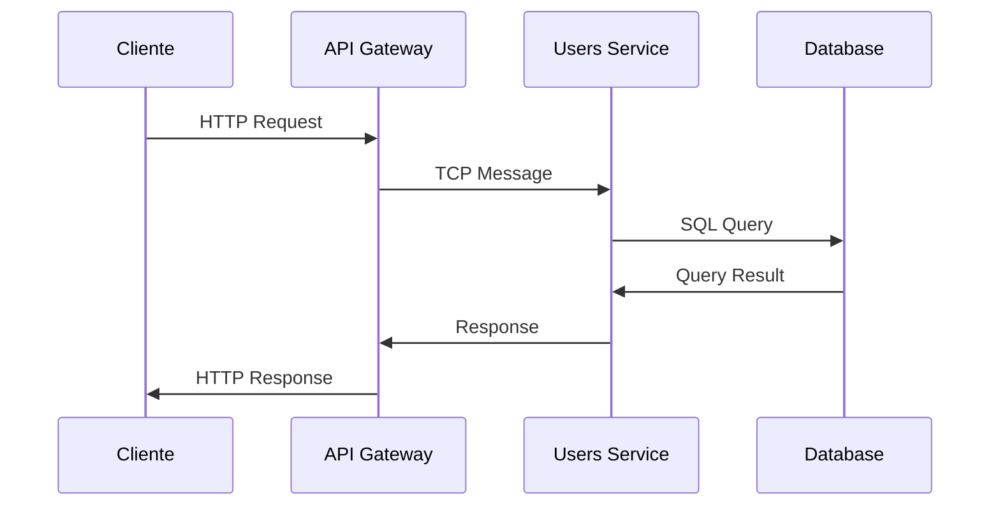
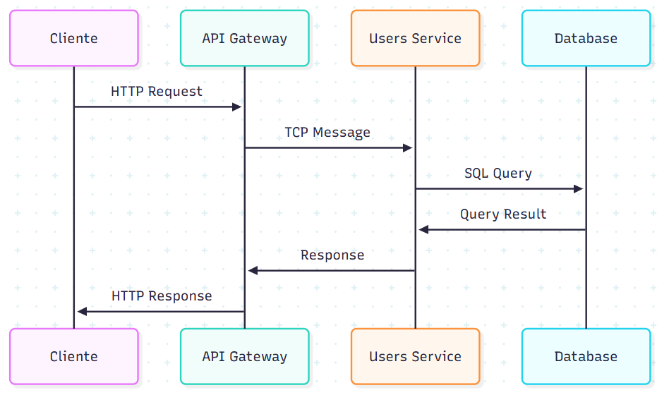

# Microsserviço com NestJS

Este projeto é uma aplicação didática para demonstrar o uso de microsserviços com NestJS, implementando uma arquitetura distribuída com comunicação entre serviços.

## 🎯 Objetivos do Projeto

- Implementar uma arquitetura de microsserviços com NestJS
- Entender o conceito de comunicação entre serviços
- Aprender sobre padrões de microsserviços
- Implementar API Gateway
- Trabalhar com banco de dados por serviço
- Entender o fluxo de comunicação entre serviços

## 🛠️ Tecnologias Utilizadas

- Node.js
- TypeScript
- NestJS
- PostgreSQL
- Docker
- TypeORM

## 📋 Estrutura do Projeto

```
apps/
├── api-gateway/           # API Gateway
│   └── src/
│       ├── gateway/       # Módulo do Gateway
│       └── app.module.ts  # Módulo principal
├── users-service/         # Serviço de Usuários
│   └── src/
│       ├── users/        # Módulo de Usuários
│       └── app.module.ts # Módulo principal
 libs/                  # Biblioteca compartilhada
    └── shared/
        └── src/
            ├── dto/         # DTOs compartilhados
            └── entities/    # Entidades compartilhadas
```

## 🔄 Fluxo de Dados





## 🚀 Como Executar

1. **Pré-requisitos**
   - Node.js 18+
   - Docker e Docker Compose

2. **Configuração do Ambiente**
   ```bash
   # Instale as dependências
   npm install

   # Inicie os bancos de dados
   docker-compose up -d
   ```

3. **Iniciar os Serviços**
   ```bash
   # Iniciar o serviço de usuários
   npm run start:users

   # Iniciar o API Gateway
   npm run start:gateway
   ```

## 📖 Documentação da API (Swagger)

Este projeto utiliza Swagger para documentar a API. Para acessar a documentação interativa:

1. Certifique-se de que o API Gateway esteja em execução
2. Acesse no navegador: http://localhost:3000/api-doc

Na interface do Swagger você pode:
- Visualizar todos os endpoints disponíveis
- Testar as operações diretamente pelo navegador
- Ver modelos de dados (DTOs) e schemas
- Entender os códigos de resposta e parâmetros necessários
- Executar requisições com diferentes parâmetros

A documentação é gerada automaticamente a partir dos decoradores nos controllers e DTOs.

## 📝 Exemplos de Uso

### Criar um Usuário
```bash
curl -X POST http://localhost:3000/gateway/users \
  -H "Content-Type: application/json" \
  -d '{
    "name": "João Silva",
    "email": "joao.silva@email.com",
    "password": "123456"
  }'
```

### Listar Usuários
```bash
curl -X GET http://localhost:3000/gateway/users
```

### Buscar Usuário por ID
```bash
curl -X GET http://localhost:3000/gateway/users/1
```

## 🧠 Passo a Passo do Desenvolvimento

Para entender como este projeto foi desenvolvido, pode-se seguir os seguintes passos:

1. **Configuração do Monorepo**
   - Criação do projeto NestJS com estrutura de monorepo
   - Configuração dos workspaces no `package.json`

2. **Criação do Serviço de Usuários**
   - Implementação da entidade `User`
   - Implementação do controller com padrão de microsserviço
   - Configuração do banco de dados com TypeORM
   - Implementação dos DTOs e validação

3. **Criação do API Gateway**
   - Implementação do controller para roteamento
   - Configuração da comunicação TCP com o serviço de usuários
   - Implementação da documentação com Swagger

## 🚧 Deploy do Sistema

Para realizar o deploy do sistema, você pode seguir os seguintes passos:

1. **Criar uma imagem Docker para cada serviço**: Utilize o Dockerfile para criar uma imagem Docker para cada serviço, incluindo o API Gateway e o serviço de usuários.
2. **Criar um arquivo docker-compose para produção**: Crie um arquivo docker-compose para produção, configurando as imagens Docker criadas anteriormente e ajustando as configurações para o ambiente de produção.
3. **Executar o docker-compose para produção**: Execute o comando `docker-compose up -d` para iniciar os serviços em segundo plano.
4. **Configurar o balanceador de carga**: Configure um balanceador de carga para distribuir as solicitações entre as instâncias do serviço.
5. **Configurar o DNS**: Configure o DNS para apontar para o balanceador de carga.
6. **Realizar testes**: Realize testes para garantir que o sistema está funcionando corretamente em produção.

## 📚 Conceitos Abordados

1. **Microsserviços**
   - Arquitetura de microsserviços
   - API Gateway
   - Comunicação entre serviços
   - Banco de dados por serviço
   - Padrões de microsserviços

2. **Comunicação entre Serviços**
   - Comunicação síncrona
   - Comunicação assíncrona
   - Padrões de comunicação
   - Protocolos de comunicação

3. **API Gateway**
   - O que é e para que serve
   - Benefícios do uso
   - Padrões de roteamento
   - Agregação de serviços
   - Transformação de dados

4. **Banco de Dados**
   - Banco de dados por serviço
   - Tipos de bancos de dados
   - Migrações
   - Sincronização de dados
   - Consistência de dados

5. **Implementação**
   - Arquitetura em camadas
   - Injeção de dependência
   - Tratamento de erros
   - Validação de dados
   - Documentação da API

## 🔍 Pontos de Atenção

- O projeto utiliza a comunicação TCP (Transmission Control Protocol) entre os serviços, garantindo uma conexão confiável e ordenada para a troca de dados.
- Cada serviço pode ter próprio banco de dados
- A API Gateway roteia as requisições para os serviços apropriados
- Os serviços são independentes e podem ser escalados separadamente
- A biblioteca shared contém código compartilhado entre os serviços

## 🚧 O que é TCP?

TCP (Transmission Control Protocol) é um protocolo de rede que garante a entrega confiável de dados em uma rede. Ele é um protocolo de transporte que opera na camada de transporte do modelo OSI, garantindo que os dados sejam transmitidos de forma ordenada e sem erros. TCP é um protocolo de conexão, o que significa que uma conexão é estabelecida entre o remetente e o destinatário antes de começar a transferir dados. Isso garante que os dados sejam entregues na ordem correta e sem perda ou duplicação.

## 🔧 Troubleshooting Comum

### Problema: Serviços não conseguem se comunicar
**Solução**: Verifique se:
- Os serviços estão executando nas portas corretas
- O ClientsModule está configurado corretamente
- As configurações de host e porta estão corretas

### Problema: Banco de dados não conecta
**Solução**: Verifique se:
- O Docker está rodando
- As configurações de conexão estão corretas
- O banco de dados foi inicializado corretamente

### Problema: Erros de validação
**Solução**: Verifique se:
- Os DTOs estão configurados corretamente
- A validação global está habilitada
- Os decoradores de validação estão sendo usados corretamente

## 📖 Material de Apoio

- [Documentação NestJS](https://docs.nestjs.com/)
- [Documentação TypeORM](https://typeorm.io/)
- [Documentação Docker](https://docs.docker.com/)
- [TypeScript Documentation](https://www.typescriptlang.org/docs/)
- [Curso de Microsserviços com NestJS](https://cursos.dev.br/microsservicos-nestjs)
- [Livro: Building Microservices](https://www.oreilly.com/library/view/building-microservices-2nd/9781492034018/)
- [Artigo: Padrões de Microsserviços](https://microservices.io/patterns/index.html)
- [Tutorial: NestJS com TCP](https://docs.nestjs.com/microservices/basics)

## 🚀 Próximos Passos

Para evoluir este projeto, considere:


1. **Implementar Autenticação**
   - Adicione autenticação JWT ao sistema
   - Implemente proteção de rotas no API Gateway
   - Adicione validação de tokens no serviço de usuários

2. **Adicionar um Novo Serviço**
   - Crie um serviço de produtos
   - Implemente CRUD para produtos
   - Integre o serviço no API Gateway

3. **Implementar Logs Centralizados**
   - Adicione logs estruturados
   - Configure um serviço de logs centralizado
   - Implemente rastreamento de requisições

4. **Adicionar Observabilidade**
   - Implementar métricas
   - Adicionar traces distribuídos
   - Configurar dashboards de monitoramento

5. **Implementar Resiliência**
   - Adicionar circuit breaker
   - Implementar retentativas
   - Configurar timeouts

6. **Adicionar Mensageria**
   - Implementar comunicação assíncrona com RabbitMQ ou Kafka
   - Criar produtores e consumidores de eventos
   - Implementar padrões de mensageria

7. **Configurar CI/CD**
   - Automatizar testes
   - Configurar pipeline de deploy
   - Implementar versionamento semântico

## 🤝 Contribuindo

Sinta-se à vontade para abrir issues ou enviar pull requests com melhorias para o projeto.
